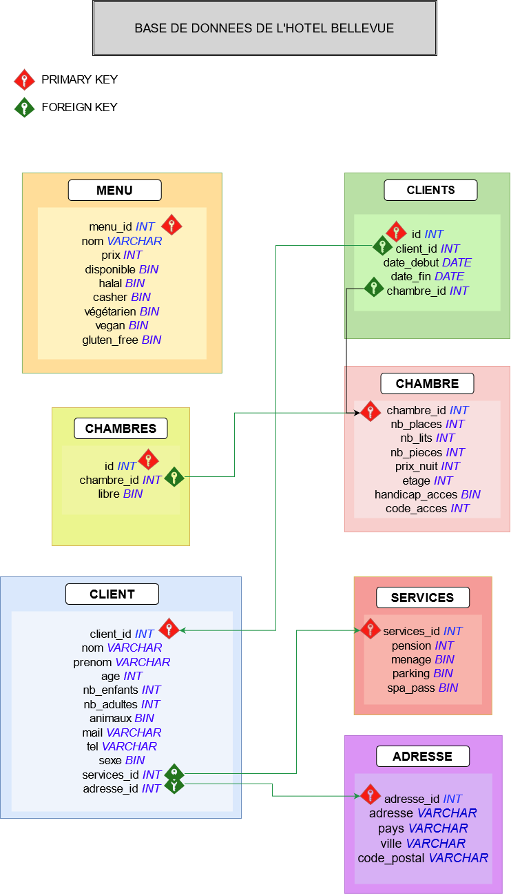

# Evaluation SQL

## Partie 1 : Conception d'une base de données

➡️ **Imaginez la base de données d'un hôtel et écrivez un script SQL permettant de mettre en place cette base de données.**

VOIR `create_tables.sql`

Diagramme :

