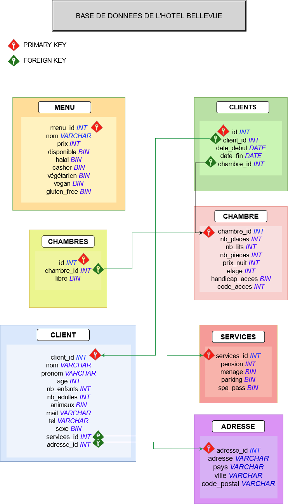

# Evaluation SQL

## Partie 1 : Conception d'une base de données

➡️ **Imaginez la base de données d'un hôtel et écrivez un script SQL permettant de mettre en place cette base de données.**

VOIR `create_tables.sql`

Diagramme :

## Partie 2 : Créer des fixtures (données bouchons)

➡️ **Créez un script permettant de remplir la base de données avec des données bouchons.**

Pour faire ça j'utilise Faker avec Python et SQLAlchemy en utilisant Docker comme moyen de stockage.
J'ai suivi ce tuto : https://python.plainenglish.io/generating-a-fake-database-with-python-8523bf6db9ec

Tout mes fichiers sont dans le dossier `/venv`.
