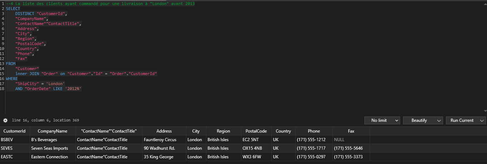

## Partie 3 : Analyser une base de données

**1** Le prix total des commandes contenant plus de 5 articles différents

1.1 -> Réduction de 25% sur le prix du produit à l'unité avant multiplication à la quantité

---

1.2 -> Réduction de 0.25% sur le prix du produit à l'unité avant multiplication à la quantité

---

1.3 -> Réduction de 25% sur le prix total

---

1.4 -> Réduction de 0.25% sur le prix total

---

**2** La liste de tous les territoires de Peacock Margaret

---

**3** La liste des clients vivant à "London"

---

**4** La liste des clients ayant commandé pour une livraison à "London" avant 2013

---

**5** Afficher le client qui a fait le plus de commande vers le "Brazil"

---

**6** Afficher la valeur total de la commande avec l'id 10260

---

**7** Afficher la valeur de toutes les commandes infèrieur à la moyenne de toutes les commandes

---

**8** Lister tous les pays de la base de données (dans les tables employee, order, customer), indiquer pour chaque pays le nombre de lignes correspondantes dans toute la base de données. (Chaque pays ne doit pas apparaître en doublon)

J'ai pas terminé les deux autres exercices mais j'ai commencé celui-ci, le code est dans queries.sql

---

**9** Le nom et prénom des employés en ajoutant:

    le nombre total de commande
    le total des commandes par employé
    le pays dans lequel ils ont fait le plus de commande
    le poids total de toutes les commandes par employé
    le pourcentage de vente par rapport au meilleur vendeur